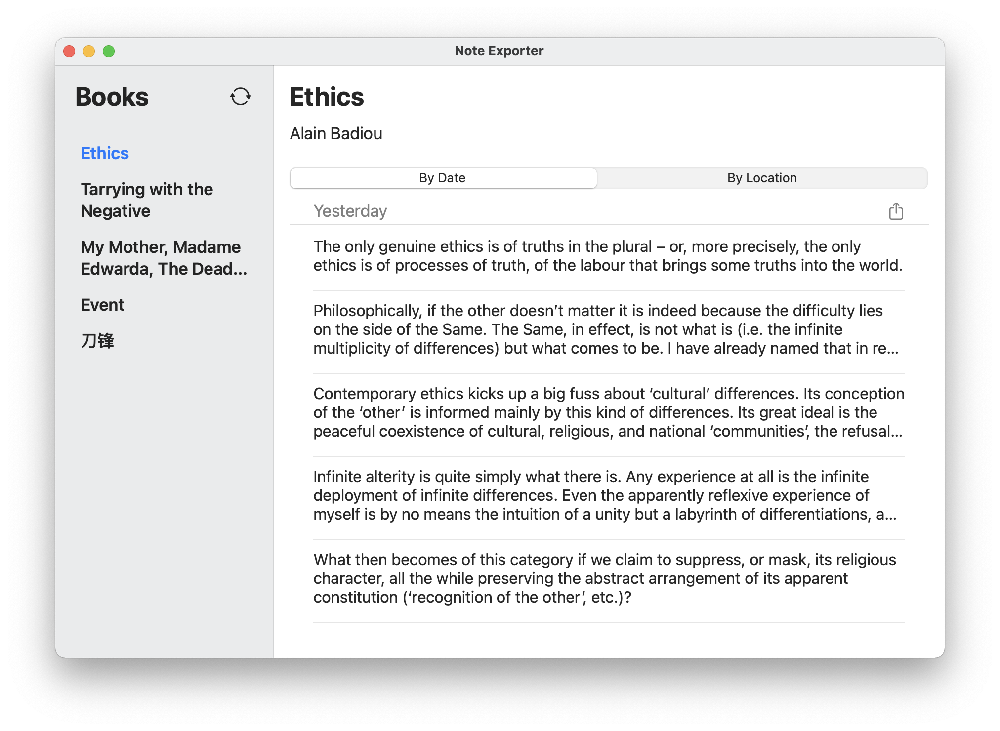
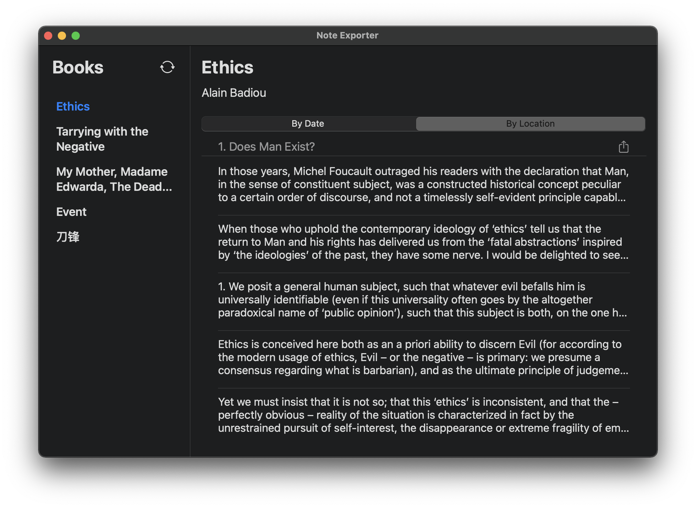

# Note-Exporter

Note Exporter can be downloaded [here](https://github.com/Alexs7zzh/Note-Exporter/raw/main/build/Note%20Exporter.dmg).

Note Exporter is a SwiftUI App for exporting highlights from iBooks. It is a pity that the Apps for exporting highlights are mostly unusable ([Digested](http://www.drivenpixels.com/digested) is too old, and [Klib](http://klib.me) does not work properly at least on my Mac). There are some usable scripts on GitHub for exporting highlights, but they lack the flexibility to choose which part of books to export based on date or chapter.

Yet iBooks remains, in my opinion, the best ebook reading App on iOS in terms of reading and highlighting experience. Therefore I started building this App. It is built on Xcode 12.2 beta, and thus it may not run on older versions of macOS. This App has not been properly tested nor polished, but in terms of its functionality, this App is completed. Any contribution will be appreciated.

## Install

Since I do not have an Apple developer account, this App is not signed and will be reported to be from an unidentified developer. To install this App, you will need to:
1. Find the App in the Finder.
2. Right-click the App.
3. Select Open.
4. In the prompt warning that the App is from an unidentified developer, click Open to continue.

## Usage

1. Make sure you have launched Books App for books to be synced first.
2. This App does not watch the changes from Books App. If you need Note Exporter to reload highlights, please click the reload button at the top of the sidebar.
3. Click the Share button to export the highlights from a specific date or part of your book. 

Note: It seems that only highlights made on iOS will be marked with "chapter" information, assuming your ebook has any. 

## Screenshot

